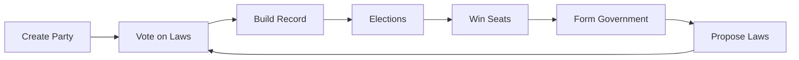

# Game Concept

Lawmaker is a **multiplayer political simulation game** that puts you in charge of a political party in a fictional democratic country. Your goal is to build electoral success through strategic legislation, coalition building, and understanding voter behavior.

## Core Gameplay Loop

1. **Create your party** with a distinct ideology
2. **Vote on proposals** from other parties
3. **Build your legislative record** through consistent voting
4. **Compete in elections** where voters judge your record
5. **Win seats** in the legislature
6. **Form governments** and appoint cabinet ministers
7. **Propose new laws** to shape the country
8. Repeat!

## Key Concepts

### Political Parties

You control a **political party** - a group representing specific ideological positions. Your party:

- Has positions on 8+ major political issues
- Gains representation through elections
- Proposes and votes on legislation
- Recruits [characters](gameplay/characters.md) as activists
- Uses [Political Power](gameplay/resources.md) as a resource

Learn more: [Party Management](gameplay/parties.md)

### Legislative Process

The heart of Lawmaker is the **legislative system**:

- Any party can **propose a law** (costs 30 PP)
- Proposals contain 1-5 **articles** (individual law changes)
- All parties **vote** on each proposal (Yes/No/Abstain)
- Votes are weighted by **seat count** in the legislature
- After 60 game days, proposals pass or fail based on majority

Each law has multiple **options** representing different policy positions. For example, the minimum wage law has three options:

- No minimum wage (free market)
- Basic minimum wage (moderate)
- High living wage minimum (worker-friendly)

Learn more: [Legislation & Voting](gameplay/legislation.md)

### Voter Simulation

Elections are determined by **individual simulated voters** (called "electors"):

- Each country has ~60 electors representing the population
- Each elector has **personal preferences** on political issues
- Electors analyze your **voting record** to form opinions
- They vote for parties that support policies they agree with
- Recent votes matter more than old votes (time-weighted)

!!! example "How Voters Think"
    An elector who strongly supports environmental protection will favor parties that voted for green energy laws and against deregulation. If your party voted for coal subsidies, this elector probably won't vote for you!

Learn more: [Elections & Voters](gameplay/elections.md)

### Electoral System

Lawmaker uses **proportional representation**:

- Vote share determines seat allocation
- 10% of votes ≈ 10% of seats
- No single party usually wins a majority
- Coalition building is essential

Elections happen on a **regular schedule** (typically every 4 game years).

### Government Formation

After elections, parties can attempt to **form governments**:

- [Cabinet positions](gameplay/cabinet.md) represent executive power (Prime Minister, ministers, etc.)
- Parties nominate [characters](gameplay/characters.md) for these positions
- All parties vote on the proposed government
- Successful formations give parties executive authority

Learn more: [Government & Cabinet](gameplay/cabinet.md)

### Characters

Your party recruits **characters** - individual activists who:

- Represent your party publicly
- Can hold cabinet positions
- Have unique traits (Charismatic, Media Savvy, etc.)
- Build followers and authority over time
- Post political commentary

There are also **journalists** - independent characters who comment on politics but aren't affiliated with parties.

Learn more: [Characters & Activists](gameplay/characters.md)

### Political Power (PP)

**Political Power** is your action resource:

- Gain a base 1 PP per game day (1 real hour), modified by your positions
- Maximum capacity: 120 PP
- Spend PP to take major actions

This system prevents spam and encourages strategic decision-making.

Learn more: [Political Power](gameplay/resources.md)

## Game Time

!!! info "Time Progression"
    **1 real-world hour = 1 game day**

    This means:
    - 1 real day = 24 game days
    - 1 real week = ~168 game days (~7 game months)
    - 1 real month = ~720 game days (~2 game years)
    - Elections every 4 game years = ~2 real months

The slow pace allows players to participate without constant attention. Check in once or twice a day to make decisions.

## Win Conditions

Lawmaker is an **ongoing simulation** without a fixed end. Success can mean:

- **Electoral dominance** - Win the most seats consistently
- **Legislative legacy** - Pass significant laws that shape the country
- **Coalition leadership** - Lead governments and appoint cabinets
- **Ideological victory** - Move the country toward your values
- **Long-term influence** - Build a party that lasts for many election cycles

## Strategic Depth

Success in Lawmaker requires balancing:

- **Ideological purity** vs. **electoral viability** - Do you vote your conscience or chase voters?
- **Short-term gains** vs. **long-term strategy** - Opportunistic votes may hurt your record
- **Solo play** vs. **coalition building** - Can you win without allies?
- **Resource management** - When to spend Political Power and when to save it
- **Timing** - When to propose laws, call elections, or form governments

## Multiple Countries

Each [country](countries.md) is an **independent simulation**:

- Different countries don't interact
- Each has unique population, seats, and cabinet structure
- You can create parties in multiple countries
- Each country develops its own meta-game and community

## What Makes Lawmaker Unique?

Unlike most political games:

- **Real human opposition** - You compete against other players, not AI
- **Voter simulation** - Elections aren't random; they reflect your voting record
- **Long-term consequences** - Every vote matters for future elections
- **Social gameplay** - Negotiation and coalition building are essential
- **Asymmetric competition** - Small parties can punch above their weight through strategy

## Next Steps

Ready to dive deeper into specific systems?

- [Party Management](gameplay/parties.md) - Build and customize your party
- [Legislation & Voting](gameplay/legislation.md) - The legislative process
- [Elections & Voters](gameplay/elections.md) - How elections work
- [Characters & Activists](gameplay/characters.md) - Recruit your team
- [Government & Cabinet](gameplay/cabinet.md) - Form governments
- [Strategy Guide](strategy-guide.md) - Tips for success
