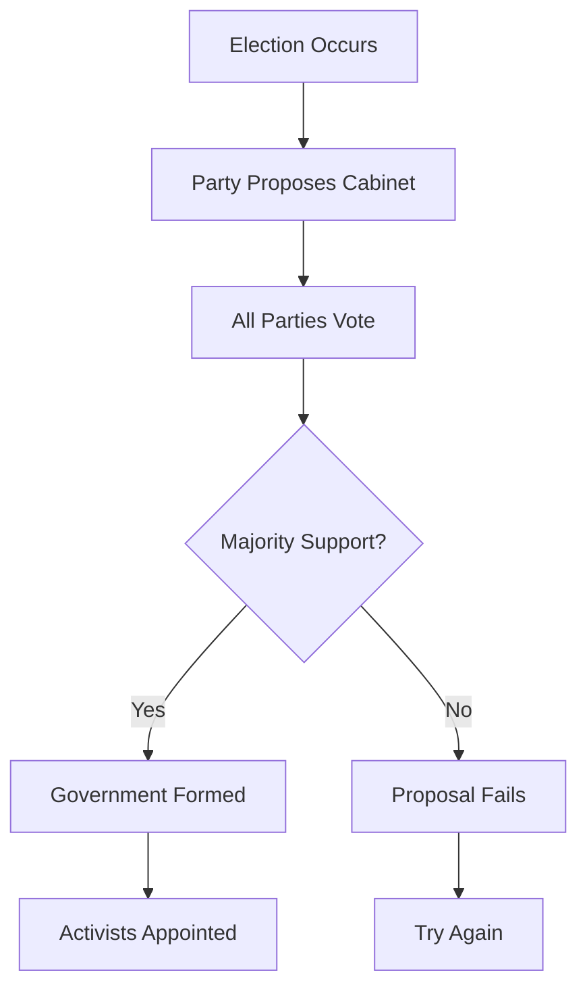

# Government & Cabinet

The **cabinet** represents executive power in Lawmaker. After elections, parties form governments by appointing [characters](characters.md) to cabinet positions. This guide explains the cabinet system and government formation.

## What is the Cabinet?

The **cabinet** is the executive government of a country, consisting of:

- **Prime Minister** (or equivalent) - Head of government
- **Ministers** - Department heads (Finance, Foreign Affairs, etc.)
- Other **cabinet positions** - Varies by country

Cabinet positions are held by [activists](characters.md) nominated by political parties.

## Cabinet Positions

### Common Positions

Most countries have positions like:

| Position | Responsibilities |
|----------|-----------------|
| **Prime Minister** | Head of government, leads cabinet |
| **Deputy Prime Minister** | Second-in-command |
| **Finance Minister** | Economic policy, budget |
| **Foreign Minister** | International relations, diplomacy |
| **Home Secretary** | Internal affairs, law enforcement |
| **Defense Minister** | Military, national security |
| **Education Minister** | Schools, universities |
| **Health Minister** | Healthcare system |
| **Environment Minister** | Climate, conservation |

### Country-Specific Cabinets

Each [country](../countries.md) has its own cabinet structure:

- Different position names
- Different number of positions
- Unique roles and responsibilities
- Cultural variations

Check your country's cabinet template to see available positions.

### Symbolic Power

Cabinet positions in Lawmaker are primarily **symbolic**:

- ✓ **Prestige** for the holding party
- ✓ **Character development** (boosts authority and followers)
- ✓ **Political statement** about priorities
- ✗ **Limited mechanical effect** (no direct power over laws)

!!! info "Why Symbolic?"
    In Lawmaker, legislative power comes from seats and voting. Cabinet positions represent political success and coalition agreements rather than gameplay mechanics.

## Government Formation

### When Governments Form

Government formation happens:

- **After elections** - New legislature needs a government
- **After collapse** - Previous government fell apart
- **Voluntary change** - Parties agree to reshuffle

### The Formation Process

1. A party creates a **cabinet formation proposal**
2. They nominate [activists](characters.md) for each position
3. All parties **vote** on the proposal (60-day period)
4. **Majority support** → Government forms
5. **Majority opposition** → Proposal fails
6. Process repeats until government forms

### Proposing a Cabinet

To propose a cabinet formation:

1. Navigate to government formation
2. Select activists for each cabinet position
3. Write a description/justification
4. Submit for voting

**Cost:** Free (no Political Power required)

!!! tip "Coalition Cabinets"
    If no party has a majority, you'll need to negotiate with other parties. Offer cabinet positions to coalition partners in exchange for their support.

### Voting on Formations

All parties vote on cabinet proposals:

- **Yes** - Support this government
- **No** - Oppose this government
- **Abstain** - No position

Votes are weighted by **seat count** (like [legislation](legislation.md)).

### Formation Requirements

For a cabinet to be approved:

- **Majority support** required (>50% of voting weight)
- All positions must have nominees
- Nominees must be activists (not journalists)
- Nominees can be from any party (coalition governments)

## Coalition Governments

### Why Coalitions Matter

With proportional representation:

- Single party rarely has majority
- Need votes from multiple parties
- Cabinet positions = bargaining chips
- Stable government requires coalition agreements

### Building Coalitions

To form a coalition government:

1. **Identify potential partners** - Ideologically compatible parties
2. **Open negotiations** - Use [messaging system](communication.md)
3. **Offer cabinet positions** - Distribute positions among coalition members
4. **Agree on policies** - Legislative agenda for the term
5. **Coordinate votes** - Support each other's proposals
6. **Maintain trust** - Honor agreements

### Coalition Agreements

Typical coalition terms:

- **Cabinet distribution** - Which party gets which positions
- **Legislative priorities** - What laws to propose/support
- **Vote coordination** - How to vote on key issues
- **Duration** - How long coalition lasts
- **Exit conditions** - When coalition can be dissolved

!!! example "Coalition Deal"
    **"Progressive Alliance Coalition"**

    **Parties:** Green Party (230 seats) + Social Democrats (180 seats) + Liberal Party (90 seats)
    **Total:** 500/650 seats (77% - comfortable majority)

    **Cabinet Distribution:**
    - Green Party: Prime Minister, Environment Minister, Transport Minister
    - Social Democrats: Finance Minister, Health Minister, Education Minister
    - Liberal Party: Foreign Minister, Justice Minister

    **Agreement:** Support green energy transition, universal healthcare expansion, progressive taxation

### Coalition Breakdown

Coalitions can collapse when:

- Parties disagree on key votes
- One party leaves coalition
- Trust breaks down
- Electoral changes shift balance
- New coalition forms without you

## Cabinet Benefits

### For Your Party

Holding cabinet positions gives:

- **Prestige** - Recognition as part of government
- **Visibility** - Public profile boost
- **Character growth** - Activists gain authority and followers
- **Bargaining power** - Leverage in future negotiations
- **Electoral credibility** - "Experience in government"

### For Characters

[Activists](characters.md) in cabinet gain:

- **Faster follower growth** - Public attention
- **Authority increases** - Government experience
- **Profile boost** - Name recognition
- **Career development** - Path to leadership

!!! success "Cabinet as Investment"
    Even if cabinet positions have limited mechanical power, they're valuable for building your party's long-term profile and developing strong characters.

## Government Strategy

### When to Lead Formation

As the **leading party**, propose formation when:

✓ **You have most seats** - Natural right to lead
✓ **Coalition is secure** - Partners ready to support
✓ **Clear agenda** - Legislative priorities set
✓ **Good timing** - Right after election

### When to Join Coalition

As a **junior partner**, join when:

✓ **Fair cabinet share** - Positions proportional to seats
✓ **Policy alignment** - Compatible legislative goals
✓ **Trustworthy partners** - Reliable parties
✓ **Better than opposition** - Best available deal

### When to Oppose

Vote against formation when:

✓ **Ideologically opposed** - Government contradicts your values
✓ **Poor deal** - Better terms might come
✓ **Opposition strategy** - Building alternative coalition
✓ **Excluded unfairly** - Should be included but aren't

### Distribution Fairness

Cabinet positions should roughly match:

- **Seat share** - More seats = more positions
- **Coalition contribution** - Parties providing majority support
- **Negotiating power** - Leverage in talks

!!! warning "Greedy Formations Fail"
    If one party tries to take all positions despite not having a majority, other parties will vote it down. Be fair in coalition negotiations!

## Government Duration

### Length of Service

Governments typically last:

- **Until next election** - Natural endpoint
- **Until collapse** - Coalition breaks down
- **Until new formation** - Parties agree to reshuffle

### Stability Factors

Stable governments have:

- Strong majority (>60% seats)
- Few coalition partners (2-3 parties)
- Ideological compatibility
- Clear agreements
- Active communication

### Government Collapse

Governments fall when:

- Coalition parties turn against each other
- Major policy disagreement
- New coalition forms without current government
- Election dramatically shifts seats

## Advanced Tactics

### Minority Governments

**Minority government** = Government with <50% seats

- Risky but possible
- Requires case-by-case support from opposition
- Can work if opposition is fragmented
- Unstable but gives you control

### Grand Coalitions

**Grand coalition** = Ideologically opposite parties govern together

- Left + Right wing parties
- Unusual but strategic
- Often formed in crisis
- Can alienate party bases

### Opposition Strategy

Not in government? Be effective opposition:

- Vote against government proposals
- Propose alternative policies
- Build shadow cabinet
- Prepare for next election
- Form alternative coalition

## Tips for Government Formation

!!! success "Formation Tips"
    1. **Negotiate before proposing** - Line up votes first
    2. **Be fair in distribution** - Proportional to seat share
    3. **Communicate clearly** - Use [messages](communication.md)
    4. **Honor agreements** - Build trust for future coalitions
    5. **Consider ideology** - Natural partners make stable governments
    6. **Use best characters** - Put high-profile activists in cabinet
    7. **Think strategically** - Cabinet builds party credibility

!!! warning "Common Mistakes"
    - **Proposing without votes** - Wasting time on doomed proposals
    - **Greedy distribution** - Taking too many positions
    - **Poor communication** - Not negotiating with partners
    - **Breaking agreements** - Destroying trust
    - **Random nominations** - Not considering character quality
    - **Ignoring opposition** - Treating them as irrelevant

## Next Steps

- [Characters & Activists](characters.md) - Recruit cabinet candidates
- [Elections & Voters](elections.md) - Win seats to form governments
- [Party Management](parties.md) - Build coalition relationships
- [Communication](communication.md) - Negotiate coalition terms
- [Strategy Guide](../strategy-guide.md) - Advanced coalition tactics
