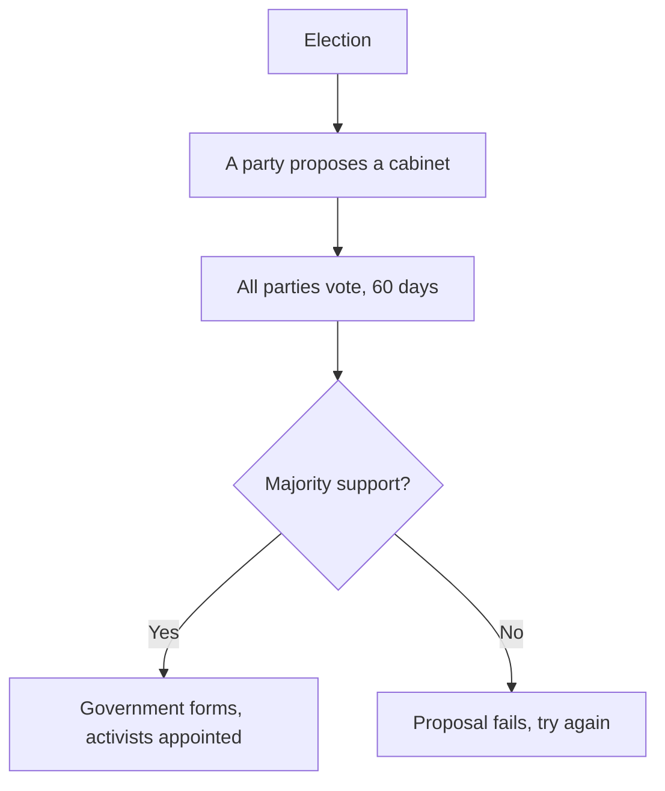

# Government & Cabinet

The **cabinet** is a country's executive government — the Prime Minister and ministers. After an election, parties form a government by nominating their [activists](characters.md) to these posts. This guide covers how that works.

## What the cabinet is

A cabinet is a set of positions — Prime Minister (or equivalent) plus ministers for finance, foreign affairs, defence, health, and so on. The exact roles and their number **vary by country**; check your country's cabinet template.

!!! info "Cabinet posts are mostly symbolic"
    Legislative power in Lawmaker comes from **seats and votes**, not cabinet posts. Holding office gives your party prestige and visibility, and boosts the appointed activist's authority and follower growth — but it doesn't grant direct power over laws. (The exception: a [constitution](constitution.md) can assign specific powers to a named cabinet position.) Treat the cabinet as recognition and long-term character development rather than a lever over legislation.

## Forming a government

```mermaid
graph TD
    A[Election] --> B[A party proposes a cabinet]
    B --> C[All parties vote, 60 days]
    C --> D{Majority support?}
    D -->|Yes| E[Government forms, activists appointed]
    D -->|No| F[Proposal fails, try again]
```

A party proposes a cabinet for **30 PP**, nominating an activist for every position. All parties then vote (weighted by seats, over a 60-day window), and the cabinet forms if it wins majority support. Nominees can come from **any** party, which is what makes coalition governments possible.

You can build your proposed cabinet as a **draft** first (this is free and stays private to your party) and only pay the 30 PP when you **open it for voting**. Only **one** formation vote can run at a time per country, so a draft never blocks other parties — but opening yours is held until any vote already underway has resolved.

## Coalitions

Because proportional representation rarely hands one party a majority, governments are usually **coalitions**, and cabinet positions are the bargaining chips. To build one, you offer posts to partners in rough proportion to the seats they bring, agree on a shared agenda, and coordinate your votes.

!!! warning "Be fair, or it fails"
    A party that grabs most of the cabinet without the seats to justify it will simply be voted down. Distribute positions roughly in line with each partner's contribution.

Two less common shapes are worth knowing: a **minority government** (under 50% of seats, surviving on case-by-case opposition support — workable but unstable) and a **grand coalition** (ideologically opposed parties governing together, usually in a crisis).

The detailed tactics of *who* to partner with, when to lead versus join, and how to keep a coalition together live in the [Strategy Guide](../strategy-guide.md).

## Next steps

- [Elections & Voters](elections.md) — win the seats that make a government possible.
- [Characters & Activists](characters.md) — recruit the activists you'll appoint.
- [Communication](communication.md) — negotiate the coalition deal.
