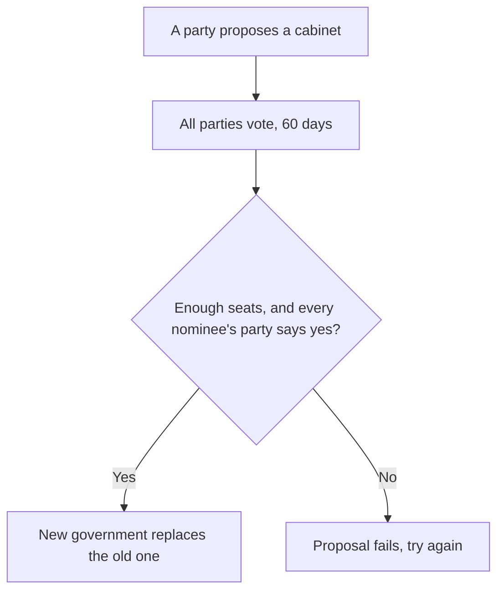

# Government & Cabinet

The **cabinet** is a country's executive government: the Prime Minister (or equivalent) and ministers for finance, defence, health and so on. Parties form a government by nominating [activists](characters.md) to these posts. The exact roles vary by country.

!!! info "Cabinet posts are mostly symbolic"
    Legislative power comes from **seats and votes**, not cabinet posts. Office gives your party prestige, boosts the appointed activist's authority, followers and profile, and raises your [PP generation](../reference.md#political-power-pp). It doesn't grant direct power over laws, with one exception: a [constitution](constitution.md) can assign specific powers (such as [executive actions](executive-actions.md)) to a named cabinet position. It also counts as "being in power" for [voter demands](demands.md#the-power-test-in-detail).

If a cabinet position is the country's **head of government**, its party can also call a [Constitutional Convention](constitution.md#constitutional-conventions) for 75 PP.

## Forming a government

```mermaid
graph TD
    A[A party proposes a cabinet] --> B[All parties vote, 60 days]
    B --> C{Enough seats, and every nominee's party says yes?}
    C -->|Yes| D[New government replaces the old one]
    C -->|No| E[Proposal fails, try again]
```

Any party can propose a cabinet for **20 PP** (**10 PP** when every post is vacant, since there's no sitting government to replace), nominating an activist for every position. Nominees can come from **any** party, which is what makes coalition governments possible. The proposal then goes to a **60-day** vote, weighted by seats. It passes when both conditions hold:

1. **Enough seats vote Yes.** The Yes votes must reach the legislature's approval threshold as a share of *all* its seats (a plain majority unless the constitution says otherwise). Empty or non-voting seats can't hand a minority party control.
2. **Every party that nominated a minister votes Yes.** A party can't be given a ministry it hasn't agreed to. If any nominee's party votes **No**, the proposal fails at once.

A passing cabinet **replaces the whole sitting government** and gives each appointee an authority boost. You can prepare a proposal as a private **draft** first, and only pay when you open it for voting. Only one formation vote runs at a time, and a draft never blocks anyone else.

If the constitution has an [elected office](elections.md#elected-offices) (such as a presidency) appoint the cabinet, only the party holding that office can propose one, and it passes once that party and every nominee's party vote Yes. No cabinet can be formed while the office is vacant, and a pending formation is withdrawn after any election for that office.

A sitting cabinet stays in office until a new formation replaces it or posts fall vacant. An election doesn't dissolve it, but it does cancel any formation vote still pending for the legislature, so a party that wants a new government needs to propose again once the result is in.

## Coalitions

Because proportional representation rarely hands one party a majority, governments are usually **coalitions**, and cabinet posts are the bargaining chips. Offer posts in rough proportion to the seats each partner brings, agree a shared agenda and coordinate your votes.

!!! warning "Be fair, or it fails"
    A party that grabs most of the cabinet without the seats to justify it will simply be voted down. Distribute positions roughly in line with each partner's contribution.

Two less common shapes: a **minority government** (under 50% of seats, surviving on case-by-case opposition support: workable but unstable) and a **grand coalition** (ideologically opposed parties governing together, usually in a crisis). Tactics on who to partner with and how to keep a coalition together are in the [Strategy Guide](../strategy-guide.md).

## Partial and vacant cabinets

A single position can fall vacant on its own: the [Supreme Court](supreme-court.md) removes a minister, the governing party is banned or disbanded, or the Crown fills posts one at a time. The country then has an **incomplete cabinet** rather than a collapsed government. The remaining ministers stay in office with their constitutional powers (and can still be targeted by executive actions); only the empty positions are vacant, until a new formation vote fills them.

## Next steps

- [Elections & Voters](elections.md): win the seats that make a government possible.
- [Characters & Activists](characters.md): recruit the activists you'll appoint.
- [Communication](communication.md): negotiate the coalition deal.
