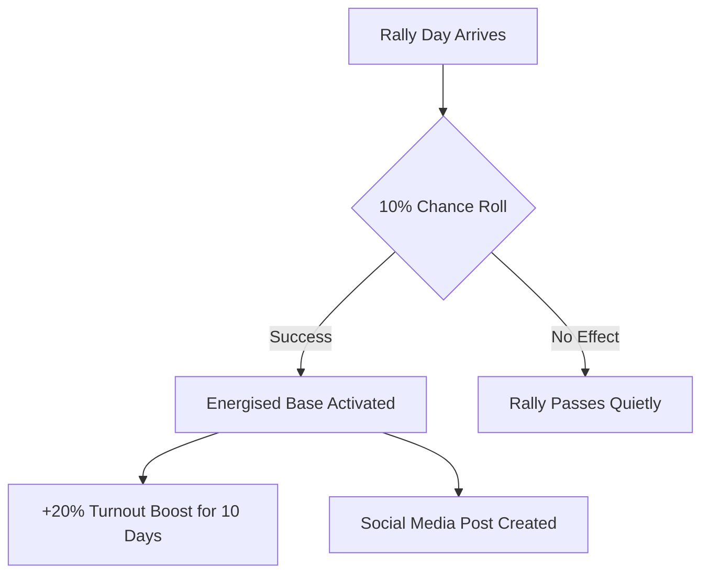

# Campaign Events

**Campaign events** let your party organise political activities on a calendar to influence elections, raise funds, and build your profile. Each party can schedule one event per day, assigning an activist to carry it out.

## The Campaign Calendar

Every party has a **campaign calendar** showing the current game month. From here you can:

- View upcoming and past events
- Schedule new events on future dates
- Edit or move future events
- See election days marked on the calendar

!!! info "One Event Per Day"
    Each party can only schedule **one campaign event per day**. Choose wisely!

### Scheduling Restrictions

- Events can only be scheduled on **future dates** (not today or in the past)
- Events **cannot be scheduled on election days**
- Past and current-day events become **read-only** and cannot be edited or deleted

## Creating an Event

To schedule a campaign event:

1. Open your party's campaign calendar
2. Click on a future date
3. Choose an **objective** (what you want to achieve)
4. Select an **event type** (how you'll achieve it)
5. Assign an **activist** from your party
6. If relevant, choose a **proposal** and your stance on it
7. Save the event

### Objectives

Each event has one of four objectives:

| Objective | Purpose | Available Event Types |
|-----------|---------|----------------------|
| **Raise Funds** | Generate money for your party | Private Dinner, Telethon |
| **Influence a Proposal** | Sway opinion on active legislation | Media Interview, Set Piece Speech |
| **Raise Profile** | Increase your party's visibility | Media Interview, Viral Social Media Stunt |
| **Get Out The Vote** | Mobilise your supporters for elections | Supporter Rally |

### Event Types

| Event Type | Description | Used For | Cost |
|------------|-------------|----------|------|
| **Supporter Rally** | A public rally to energise your base | Get Out The Vote | Free |
| **Media Interview** | A press appearance to shape the narrative | Influence a Proposal, Raise Profile | $2,000 |
| **Set Piece Speech** | A major policy address | Influence a Proposal | $15,000 |
| **Viral Social Media Stunt** | A high-risk online campaign to raise your profile | Raise Profile | $3,000 |
| **Private Dinner for Business Donors** | An exclusive fundraising dinner | Raise Funds | – |
| **Telethon for Small Donations** | A grassroots fundraising drive | Raise Funds | – |

## Supporter Rallies

Supporter Rallies are the most impactful event type currently in the game. When a rally takes place, there is a **10% chance** it will trigger the **Energised Base** modifier for your party.

### Energised Base Modifier

When triggered, the Energised Base effect gives your party:

- **+20% turnout boost** for your supporters at election time
- Lasts for **10 game days**
- A social media post is automatically created announcing the rally's success

!!! tip "Timing Your Rallies"
    Schedule Supporter Rallies in the days leading up to an election. If the Energised Base modifier triggers, the turnout boost could make a real difference to your seat count. Since the effect lasts 10 game days, try to schedule rallies within that window before polling day.

### How It Works

```mermaid
graph TD
    A[Rally Day Arrives] --> B{10% Chance Roll}
    B -->|Success| C[Energised Base Activated]
    B -->|No Effect| D[Rally Passes Quietly]
    C --> E[+20% Turnout Boost for 10 Days]
    C --> F[Social Media Post Created]
```

## Performance Events

**Media Interviews**, **Set-Piece Speeches**, and **Viral Social Media Stunts** are performance events where the result depends on your activist's abilities and current condition. A strong outcome boosts your party's vote preference; a poor one can hurt it.

All performance events generate a journalist post commenting on how it went, and any vote preference effects appear as **party modifiers** visible on your party profile page.

### What Affects the Outcome?

- **Activist traits** — A **Fantastic Speaker** is much more likely to shine; a **Poor Speaker** is at greater risk of a gaffe
- **Activist energy** — Tired and Exhausted activists underperform and are more prone to mistakes (see [Activist Energy](#activist-energy) below)

### Media Interview

An activist faces the press to shape public opinion. Can be used to sway support for a proposal or simply raise your party's profile.

| Outcome | Effect |
|---------|--------|
| **Standout** | A compelling interview that wins new voters — significant vote preference boost |
| **Success** | A solid appearance that nudges opinion in your favour |
| **Gaffe** | A stumble that damages your party's standing |

### Set-Piece Speech

A major policy address — the highest-stakes performance event. The potential rewards are greater than a media interview, but so are the consequences of failure.

| Outcome | Effect |
|---------|--------|
| **Career-Defining Speech** | An exceptional address that delivers a **permanent** vote preference boost |
| **Success** | A strong speech that boosts vote preference for a fortnight |
| **Gaffe** | A poorly received speech with a significant and lasting penalty |

!!! warning "High Stakes"
    Set-piece speeches cost significantly more than other events and carry the greatest risk. Reserve them for important moments — and never assign a tired or exhausted activist.

### Viral Social Media Stunt

A lower-cost, faster option for raising your party's online profile. The stakes are smaller, but backfire is a real risk — especially for exhausted activists.

| Outcome | Effect |
|---------|--------|
| **Hit** | The stunt goes viral and boosts your party's vote preference |
| **Backfire** | The stunt generates backlash and damages your party's standing |

!!! warning
    Exhausted activists are significantly more likely to cause a viral stunt to backfire.

---

## Activist Energy

Every activist has an **energy level** representing how much they have left in the tank. Running campaign events drains energy over time; rest restores it naturally.

### Energy States

Activists can be in one of three states, shown as traits in your activist list:

| State | Shown As | What It Means |
|-------|----------|---------------|
| Rested | *(no trait)* | Full effectiveness at all campaign events |
| Low energy | **Tired** trait | Reduced effectiveness at campaign events |
| Critically low | **Exhausted** trait | Significantly reduced effectiveness; more likely to make mistakes at interviews and speeches; increased backfire risk on viral stunts |

Energy recovers naturally over time. If an activist is carrying the **Tired** or **Exhausted** trait, easing their schedule for a while will let them recover.

!!! tip "Rotate Your Roster"
    If one of your activists has run out of steam, assign upcoming events to a fresher colleague. A deep bench pays dividends here.

!!! warning "Don't Push Exhausted Activists"
    Scheduling a high-stakes media interview or set-piece speech for an exhausted activist is a significant gamble. The increased risk of a gaffe — or a career-damaging stumble — is rarely worth it.

---

## Assigning Activists

Every campaign event requires an **activist** from your party:

- Only non-expelled activists can be assigned
- The same activist can be assigned to events on different days
- [Recruit activists](characters.md) if you don't have enough for your campaign schedule

## Proposal-Linked Events

When choosing the **Influence a Proposal** objective, you can link your event to a specific active proposal and declare your stance:

- **For** - Campaign in support of the proposal
- **Against** - Campaign in opposition to the proposal

Only proposals that are currently open (not withdrawn or closed) can be targeted.

## Managing Events

### Editing Events

You can edit any **future** event to change its:

- Date
- Objective and event type
- Assigned activist
- Linked proposal and stance

### Moving Events

Drag or move events to a different future date. The same restrictions apply — you can't move events to election days or past dates.

### Deleting Events

Future events can be deleted from the calendar. Past events are preserved as part of your campaign history.

## Party Modifiers

Campaign activity and random events can trigger **party modifiers** — temporary buffs or debuffs that affect your electoral performance.

### Energised Base (Positive)

- **Trigger:** Successful Supporter Rally (10% chance)
- **Effect:** +20% turnout boost for your supporters
- **Duration:** 10 game days

### Campaign Finance Scandal (Negative)

- **Trigger:** Random event
- **Effect:** Voters are 10% less likely to vote for your party
- **Duration:** 3 months

### Performance Event Modifiers

Media interviews, set-piece speeches, and viral stunts can each trigger vote preference modifiers on your party depending on the outcome:

| Event | Outcome | Effect |
|-------|---------|--------|
| Media Interview | Standout | Significant positive vote preference boost |
| Media Interview | Success | Modest positive vote preference boost |
| Media Interview | Gaffe | Negative vote preference penalty |
| Set-Piece Speech | Career-Defining | Permanent positive vote preference boost |
| Set-Piece Speech | Success | Significant positive vote preference boost |
| Set-Piece Speech | Gaffe | Significant negative vote preference penalty |
| Viral Social Media Stunt | Hit | Positive vote preference boost |
| Viral Social Media Stunt | Backfire | Negative vote preference penalty |

Active modifiers are displayed on your party's profile page. Keep an eye on them — a well-timed Energised Base before an election can overcome a lingering scandal, and a career-defining speech can give your party a permanent edge.

## Strategy Tips

!!! success "Best Practices"
    1. **Plan around elections** - Schedule Supporter Rallies 1-10 days before election day for maximum impact
    2. **Use your best activists** - Assign high-profile characters to important events
    3. **Fill your calendar** - One event per day means a full calendar shows an active, engaged party
    4. **Target key proposals** - Use Influence events to rally support for or against important legislation
    5. **Watch the odds** - Supporter Rallies have a 10% trigger chance, so schedule multiple for better odds of getting the Energised Base effect
    6. **Match traits to events** - Use **Fantastic Speaker** activists for media interviews and set-piece speeches
    7. **Watch activist energy** - Check for the **Tired** or **Exhausted** trait before scheduling performance events
    8. **Rotate your roster** - Spread events across multiple activists to prevent fatigue building up

!!! warning "Common Mistakes"
    - **Scheduling too late** - Events on election day itself are blocked
    - **Forgetting to assign activists** - Every event needs one
    - **Ignoring the calendar** - Campaign events are easy to overlook but can swing close elections
    - **Running the same activist every day** - They'll become Tired or Exhausted, hurting their performance
    - **Scheduling a set-piece speech with an exhausted activist** - The gaffe risk is very high

## Next Steps

- [Characters & Activists](characters.md) - Recruit activists for your campaign events
- [Elections & Voters](elections.md) - Understand how turnout affects results
- [Party Management](parties.md) - Overall party strategy
- [Political Power](resources.md) - Manage resources alongside campaigning
