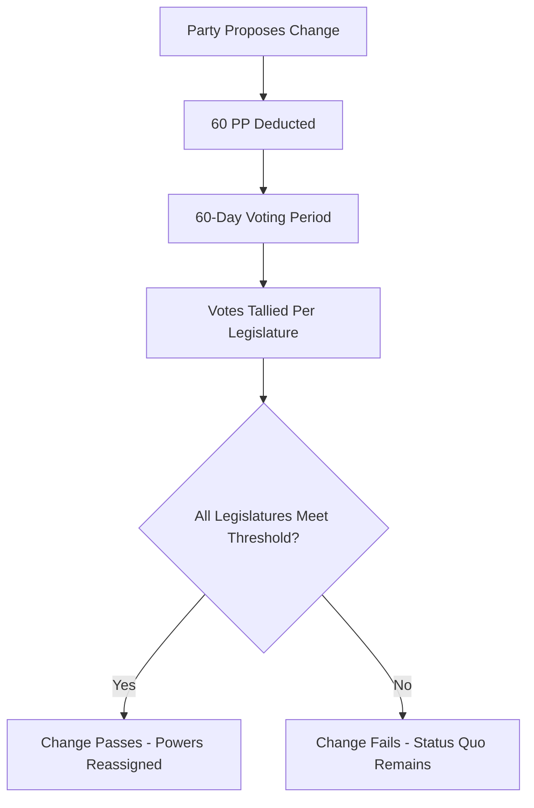

# Constitution & Constitutional Changes

Every country in Lawmaker has a **constitution** that defines how power is distributed across its institutions. The constitution assigns specific powers — such as declaring war, appointing judges, or setting monetary policy — to legislatures, cabinet positions, or independent bureaucrats.

Players can propose **constitutional changes** to redistribute these powers, fundamentally reshaping how their country's government works.

## Viewing the Constitution

Visit your country's constitution page to see all 18 constitutional powers and where each one is currently assigned:

- **Legislature** — power is held by a specific elected body (e.g. Parliament, Senate)
- **Cabinet Position** — power is held by whoever occupies that role (e.g. Prime Minister, Defence Minister)
- **Professional Non-Partisan Bureaucrats** — power is held by an independent civil service, outside political control

!!! info "Country Differences"
    Each country starts with a different constitutional arrangement. Some concentrate power in the executive, others distribute it across legislatures and bureaucrats. Check your country's constitution to understand its starting point.

## Constitutional Powers

The 18 powers defined in the constitution are:

| Power | Description |
|-------|-------------|
| **Declare War** | Formally declare war on foreign nations |
| **Commander of the Army** | Supreme command over ground forces |
| **Commander of the Navy** | Supreme command over naval forces |
| **Commander of the Air Force** | Supreme command over air forces |
| **Head of Police** | Authority over domestic law enforcement |
| **Head of Domestic Intelligence** | Authority over domestic intelligence and counter-espionage |
| **Head of Foreign Intelligence** | Authority over foreign intelligence and overseas espionage |
| **Declare Martial Law** | Impose military rule in times of emergency |
| **Decide Foreign Policy** | Set and direct the nation's foreign policy agenda |
| **Ratify Foreign Treaties** | Formally approve international treaties |
| **Designate Extremist Organisations** | Officially designate organisations as extremist or terrorist |
| **Appoint Judges** | Appoint judges to the nation's courts |
| **Regulate Businesses** | Set and enforce business regulations and standards |
| **Regulate Banks** | Regulate banking institutions and financial markets |
| **Regulate Political Parties** | Regulate party formation, funding, and conduct |
| **Regulate the Environment** | Set environmental standards and protections |
| **Set Monetary Policy** | Control interest rates, money supply, and monetary policy |
| **Set Fiscal Policy** | Control government spending, taxation, and budget |

## Proposing Constitutional Changes

Any party can propose a constitutional change to move one or more powers from their current holder to a different one.

### Creating a Proposal

1. Navigate to your country's constitutional changes page
2. Click to create a new change
3. Give it a **title** and **summary** explaining your reasoning
4. Select which **powers** to move and where they should go
5. Save as a draft, then **open** it for voting

### Requirements

- **Cost:** 60 Political Power (deducted when you open the change for voting)
- Each change must include **at least one power move**
- Only **one constitutional change** can be open for voting per country at a time
- The proposing party **automatically votes Yes** in all required legislatures

### Cooldown Period

After a constitutional change passes, there is a **cooldown period** (typically 2 years) during which no further changes can be proposed. This prevents constant constitutional upheaval.

!!! warning "High Stakes"
    At 60 PP, constitutional changes are the most expensive action in the game. Make sure you have the votes lined up before opening one.

## Voting on Constitutional Changes

Constitutional changes require a **supermajority** to pass — a higher threshold than ordinary legislation.

### Approval Process

1. The change opens for a **60-day voting period**
2. All parties vote **Yes**, **No**, or **Abstain** (votes apply across all required legislatures)
3. Votes are weighted by **seat count**, just like normal legislation
4. Each required legislature must independently meet its **approval threshold** (typically 66.6% of all seats)
5. If **all** legislatures meet the threshold, the change passes
6. If **any** legislature fails to meet the threshold, the change fails

### Key Differences from Normal Legislation

| | Normal Proposals | Constitutional Changes |
|---|---|---|
| **Cost** | 30 PP | 60 PP |
| **Threshold** | Simple majority (>50%) | Supermajority (typically 66.6%) |
| **Legislatures** | Usually one | May require approval from multiple chambers |
| **Cooldown** | None | Typically 2 years after a successful change |

### Early Resolution

A constitutional change can be resolved before the 60-day period ends:

- **Early pass** — if all legislatures already meet the supermajority threshold
- **Early fail** — if it becomes mathematically impossible for any legislature to reach the threshold (too many No votes)

### Withdrawing a Change

The proposing party can **withdraw** a constitutional change at any time, whether it is still in draft or already open for voting. However, the 60 PP is not refunded once the change has been opened.

## Strategy

### When to Propose

Constitutional changes are most likely to succeed when:

- Your party or coalition controls a **supermajority** of seats
- There is broad **cross-party consensus** on the change
- You can afford to spend **60 PP** and potentially wait out the cooldown

### Common Moves

- **Centralise executive power** — Move powers from legislatures or bureaucrats to cabinet positions your coalition controls
- **Decentralise power** — Move powers from the executive to legislatures for more democratic oversight
- **Depoliticise sensitive areas** — Move powers to professional bureaucrats to remove them from partisan control
- **Weaken rivals** — Strip powers from cabinet positions held by opposition parties

!!! tip "Build Support First"
    Unlike normal proposals that need a simple majority, constitutional changes need a supermajority. Use the [messaging system](communication.md) to negotiate with other parties and secure enough votes before spending 60 PP.

!!! warning "Common Mistakes"
    - **Proposing without the votes** — 60 PP wasted on a doomed change
    - **Ignoring the cooldown** — If a change just passed, you'll need to wait before proposing another
    - **Forgetting bicameral requirements** — In countries with two chambers, both must approve independently

## Next Steps

- [Legislation & Voting](legislation.md) - How normal proposals work (for comparison)
- [Government & Cabinet](cabinet.md) - Cabinet positions that can hold constitutional powers
- [Political Power](resources.md) - Managing the 60 PP cost
- [Communication](communication.md) - Building supermajority coalitions
