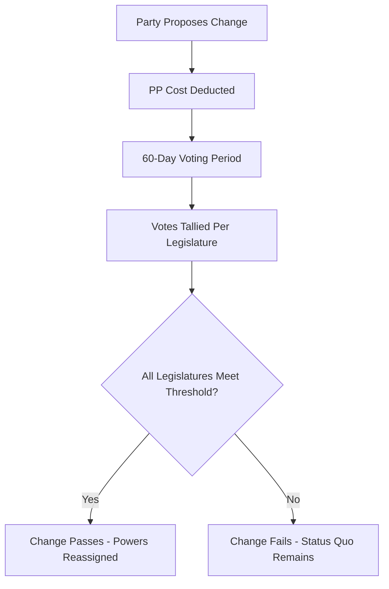

# Constitution & Constitutional Changes

Every country in Lawmaker has a **constitution** that defines how power is distributed across its institutions. The constitution assigns specific powers - such as declaring war, appointing judges, or setting monetary policy - to legislatures, cabinet positions, hereditary monarchies, or independent bureaucrats.

Players can propose **constitutional changes** to redistribute these powers, fundamentally reshaping how their country's government works.

## Viewing the Constitution

Visit your country's constitution page to see all 18 constitutional powers and where each one is currently assigned:

- **Legislature** — power is held by a specific elected body (e.g. Parliament, Senate)
- **Cabinet Position** — power is held by whoever occupies that role (e.g. Prime Minister, Defence Minister)
- **Monarchy** — power is held by the Crown in countries with a hereditary monarchy
- **Professional Non-Partisan Bureaucrats** — power is held by an independent civil service, outside political control

!!! info "Country Differences"
    Each country starts with a different constitutional arrangement. Some concentrate power in the executive, others distribute it across legislatures and bureaucrats. Check your country's constitution to understand its starting point.

## Constitutional Powers

The 18 powers defined in the constitution are:

| Power | Description |
|-------|-------------|
| **Declare War** | Formally declare war on foreign nations |
| **Commander of the Army** | Supreme command over ground forces |
| **Commander of the Navy** | Supreme command over naval forces |
| **Commander of the Air Force** | Supreme command over air forces |
| **Head of Police** | Authority over domestic law enforcement |
| **Head of Domestic Intelligence** | Authority over domestic intelligence and counter-espionage |
| **Head of Foreign Intelligence** | Authority over foreign intelligence and overseas espionage |
| **Declare Martial Law** | Impose military rule in times of emergency |
| **Decide Foreign Policy** | Set and direct the nation's foreign policy agenda |
| **Ratify Foreign Treaties** | Formally approve international treaties |
| **Designate Extremist Organisations** | Officially designate organisations as extremist or terrorist |
| **Appoint Judges** | Appoint judges to the nation's courts |
| **Regulate Businesses** | Set and enforce business regulations and standards |
| **Regulate Banks** | Regulate banking institutions and financial markets |
| **Regulate Political Parties** | Regulate party formation, funding, and conduct |
| **Regulate the Environment** | Set environmental standards and protections |
| **Set Monetary Policy** | Control interest rates, money supply, and monetary policy |
| **Grant Pardons** | Grant clemency and pardons for criminal offences |

## Proposing Constitutional Changes

Any party can propose a constitutional change to move one or more powers from their current holder to a different one.

### Creating a Proposal

1. Navigate to your country's constitutional changes page
2. Click to create a new change
3. Give it a **title** and **summary** explaining your reasoning
4. Select which **powers** to move and where they should go
5. Save as a draft, then **open** it for voting

New packages are created with a default name (e.g. "Constitutional reform from {party} of {month} {year}"), but you can change this name and add a detailed description before opening for voting.

### Requirements

- **Package name:** The package must have a **non-empty name** before you can open it for voting. You can edit the default name when reviewing your draft.
- **Cost:** 30 Political Power per proposal in the package (minimum 60 PP total), deducted when you open the package for voting. Establishing or abolishing a monarchy always costs 60 PP regardless of package size.
- **Sufficient Political Power:** Your party must have enough PP for the total cost of all items in the package.
- Each change must include **at least one power move**
- Only **one constitutional change** can be open for voting per country at a time
- The proposing party **automatically votes Yes** in all required legislatures

### Adjusting Election Frequency

In addition to redistributing powers, parties can propose to adjust how often any legislature is elected:

1. **View the constitution** - Each legislature article displays its current election frequency
2. **Click "Propose change to election frequency"** on the legislature you want to adjust
3. **Enter the new frequency** (2-120 months)
4. **Save as a draft** or **open for voting**

The proposed frequency change is added to your existing constitutional change package alongside any other proposed changes. Election frequency changes follow the same voting process as power moves:

- **Cost:** 30 PP per change item (counted alongside power moves in the package total)
- **Threshold:** Supermajority (typically 66.6%)
- **Timing:** The new frequency takes effect **prospectively** — your next scheduled election still runs under the old schedule, but elections scheduled after that will use the new frequency

!!! info "Prospective Application"
    If an election is scheduled for Day 100 under the current frequency, and you pass a change to a different frequency on Day 50, that Day 100 election still runs. The new frequency only applies when scheduling elections that occur after Day 100.

### Cooldown Period

After a constitutional change passes, there is a **cooldown period** (typically 2 years) during which no further changes can be proposed. This prevents constant constitutional upheaval.

!!! warning "High Stakes"
    Constitutional change packages cost at least 60 PP — the highest minimum of any action in the game. Make sure you have the votes lined up before opening one.

## Voting on Constitutional Changes

Constitutional changes require a **supermajority** to pass — a higher threshold than ordinary legislation.

### Approval Process

```mermaid
graph TD
    A[Party Proposes Change] --> B[PP Cost Deducted]
    B --> C[60-Day Voting Period]
    C --> D[Votes Tallied Per Legislature]
    D --> E{All Legislatures Meet Threshold?}
    E -->|Yes| F[Change Passes - Powers Reassigned]
    E -->|No| G[Change Fails - Status Quo Remains]
```

1. The change opens for a **60-day voting period**
2. All parties vote **Yes**, **No**, or **Abstain** (votes apply across all required legislatures)
3. Votes are weighted by **seat count**, just like normal legislation
4. Each required legislature must independently meet its **approval threshold** (typically 66.6% of all seats)
5. If **all** legislatures meet the threshold, the change passes
6. If **any** legislature fails to meet the threshold, the change fails

### Key Differences from Normal Legislation

| | Normal Proposals | Constitutional Changes |
|---|---|---|
| **Cost** | 30 PP | 30 PP per item (min 60 PP); 60 PP for monarchy establishment/abolition |
| **Threshold** | Simple majority (>50%) | Supermajority (typically 66.6%) |
| **Legislatures** | Usually one | May require approval from multiple chambers |
| **Cooldown** | None | Typically 2 years after a successful change |

### Early Resolution

A constitutional change can be resolved before the 60-day period ends:

- **Early pass** — if all legislatures already meet the supermajority threshold
- **Early fail** — if it becomes mathematically impossible for any legislature to reach the threshold (too many No votes)

### Withdrawing a Change

The proposing party can **withdraw** a constitutional change at any time, whether it is still in draft or already open for voting. However, the PP cost is not refunded once the change has been opened.

## Amendments

In addition to redistributing powers, parties can propose **amendments** — custom articles that become part of the constitution. Amendments are plain-text declarations with no direct gameplay effect, but they represent the will of the people.

### Examples of Amendments

- "The national bird shall be the Bald Eagle."
- "Freedom of speech is an inalienable right of every citizen."
- "The capital city shall forever remain in its current location."

### Proposing an Amendment

1. Navigate to your country's constitution page
2. Click **"Propose Amendment"**
3. Enter a **title**, the **amendment text**, and a **rationale** explaining why it should be adopted
4. Save as a draft, then **open** it for voting

Amendments follow the same voting process and requirements as constitutional power changes:

- **Package name:** The package must have a **non-empty name** before you can open it for voting
- **Cost:** 30 PP per item in the package (minimum 60 PP)
- **Sufficient Political Power:** Your party must have enough PP for the total cost
- **Threshold:** Supermajority (same as other constitutional changes)
- **Voting period:** 60 days
- **Cooldown:** Same cooldown applies — a passed amendment prevents further constitutional changes for the cooldown period

### Repealing an Amendment

If an amendment has been passed and is part of the constitution, any party can propose to **repeal** it. To do so:

1. View the constitution and find the amendment you want to repeal
2. Click **"Propose Repeal"** next to the amendment
3. Enter a **title** and **rationale** for the repeal
4. The repeal goes through the same voting process as any constitutional change

If the repeal passes, the amendment is removed from the constitution.

!!! info "Amendments in the Constitution"
    Passed amendments appear in a dedicated "Amendments" section at the end of the constitution, numbered with Roman numerals just like other constitutional articles.

## Strategy

### When to Propose

Constitutional changes are most likely to succeed when:

- Your party or coalition controls a **supermajority** of seats
- There is broad **cross-party consensus** on the change
- You can afford to spend **at least 60 PP** and potentially wait out the cooldown

### Common Moves

- **Centralise executive power** — Move powers from legislatures or bureaucrats to cabinet positions your coalition controls
- **Decentralise power** — Move powers from the executive to legislatures for more democratic oversight
- **Empower the Crown** — Move powers to a hereditary monarchy where the country has one
- **Depoliticise sensitive areas** — Move powers to professional bureaucrats to remove them from partisan control
- **Weaken rivals** — Strip powers from cabinet positions held by opposition parties
- **Signal values** — Propose amendments that reflect your party's ideology to rally supporters
- **Force a position** — Propose an amendment to force rival parties to publicly vote for or against a popular idea

!!! tip "Build Support First"
    Unlike normal proposals that need a simple majority, constitutional changes need a supermajority. Use the [messaging system](communication.md) to negotiate with other parties and secure enough votes before spending the PP.

!!! warning "Common Mistakes"
    - **Proposing without the votes** — PP wasted on a doomed change
    - **Ignoring the cooldown** — If a change just passed, you'll need to wait before proposing another
    - **Forgetting bicameral requirements** — In countries with two chambers, both must approve independently

## Next Steps

- [Legislation & Voting](legislation.md) - How normal proposals work (for comparison)
- [Government & Cabinet](cabinet.md) - Cabinet positions that can hold constitutional powers
- [Hereditary Monarchy](monarchy.md) - Crown offices that can hold constitutional powers
- [Political Power](resources.md) - Managing the PP cost
- [Communication](communication.md) - Building supermajority coalitions
