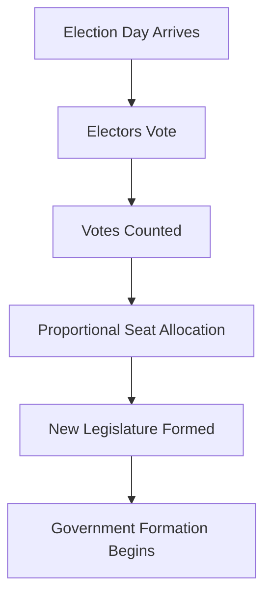

# Elections & Voters

**Elections** are how your party gains seats and political power. Understanding how voters think and how elections work is crucial for success in Lawmaker.

## How Elections Work

### Election Schedule

Elections happen on a **regular schedule**:

- Typically every **4 game years** (~96 game days = ~4 real days)
- Schedule is fixed and announced in advance
- All parties participate automatically
- Can be triggered early via [Early Election Calls](#early-elections)

### Election Process



1. **Election occurs** on the scheduled date
2. **Electors cast votes** based on their preferences
3. **Votes are counted** and percentages calculated
4. **Seats are allocated** proportionally to vote share
5. **New legislature** is formed
6. **[Cabinet formation](cabinet.md)** process begins

### Results

After an election, you'll see:

- **Vote totals** for each party
- **Vote percentages** (share of electorate)
- **Seats allocated** to each party
- **Turnout rate** (percentage of electors who voted)
- **Comparison to previous election** (gains/losses)

## Understanding Voters

### The Elector System

Lawmaker simulates **individual voters** (called "electors"):

- Each country has ~60 electors
- Each elector represents a portion of the population
- Electors are AI-driven with unique preferences
- They make decisions based on their values and your record

!!! info "Why Individual Voters?"
    Unlike games with random or formula-based elections, Lawmaker's electors actually analyze your voting record and make informed decisions. This creates realistic, consequential elections.

### Elector Preferences

Each elector has positions on the 8+ political issues:

| Elector Profile | Political Preferences |
|-----------------|----------------------|
| **Young Progressive** | High equality, environmental protection, personal liberty, open immigration |
| **Social Conservative** | Traditional values, religious influence, law & order, national identity |
| **Economic Liberal** | Free market, low taxes, business-friendly, limited regulation |
| **Democratic Socialist** | Wealth redistribution, worker rights, universal services, equality |

### How Electors Decide

Electors vote for parties by:

1. **Reviewing voting records** - How did each party vote on proposals?
2. **Comparing to preferences** - Which party's votes align with their values?
3. **Weighting recent votes** - Recent votes matter more than old votes
4. **Forming opinions** - Build a positive or negative view of each party
5. **Casting their vote** - Support the party that best matches their preferences

!!! example "Elector Decision-Making"
    **Elector Profile:** Strong environmentalist

    **Party Voting Records:**
    - **Green Alliance**: Voted FOR renewable energy, AGAINST coal subsidies
    - **Business First Party**: Voted AGAINST renewable energy, FOR coal subsidies
    - **Centrist Party**: Abstained on both

    **Result:** Elector votes for **Green Alliance** (clear match with their values)

### Time-Weighted Voting

Recent votes matter more:

- **Very recent votes** (last 30 days) - High impact
- **Recent votes** (30-90 days) - Moderate impact
- **Older votes** (90+ days) - Lower impact
- **Ancient votes** (>1 year) - Minimal impact

This simulates voter memory - people remember what you did lately more than what you did years ago.

### Turnout

Not all electors vote in every election:

- **High turnout** (>70%) - Engaged electorate, competitive race
- **Medium turnout** (50-70%) - Normal participation
- **Low turnout** (<50%) - Apathetic voters, low engagement

Factors affecting turnout:

- Controversial recent proposals (increases turnout)
- Long periods without activity (decreases turnout)
- Close competition between parties (increases turnout)

## Electoral System

### Proportional Representation

Lawmaker uses **proportional representation**:

- Vote percentage ≈ Seat percentage
- 10% of votes → ~10% of seats
- 50% of votes → ~50% of seats

This means:

✓ Small parties can win seats
✓ No party usually has a majority
✓ Coalition building is essential
✗ Hard to win outright control

### Seat Allocation Formula

Seats are allocated using a proportional system:

```
Party Seats = (Party Votes / Total Votes) × Total Seats
```

!!! example "Seat Allocation"
    **Legislature size:** 650 seats

    **Election results:**
    - Party A: 35% of votes → ~228 seats
    - Party B: 30% of votes → ~195 seats
    - Party C: 20% of votes → ~130 seats
    - Party D: 15% of votes → ~97 seats

    No party has a majority (326 seats needed). Coalition required!

### Minimum Threshold

Some legislatures may have a **minimum threshold**:

- Typically 5% of votes
- Parties below threshold win no seats
- Prevents legislature fragmentation
- Check your country's rules

## Electoral Strategy

### Building Voter Appeal

To win elections, you need to:

1. **Vote consistently** - Build clear party identity
2. **Align with voter values** - Support popular positions
3. **Time controversial votes** - Schedule unpopular votes early in cycle
4. **Show leadership** - Take stands on important issues
5. **Build coalitions** - Form alliances for post-election government

### Ideological Positioning

Where should your party position itself?

=== "Left Wing"
    **Progressive/Socialist positioning**

    Appeals to electors who want:
    - Economic equality
    - Strong worker protections
    - Environmental action
    - Social progressivism

    **Strategy:** Vote consistently for leftist policies

=== "Right Wing"
    **Conservative/Libertarian positioning**

    Appeals to electors who want:
    - Free market economics
    - Traditional values
    - Strong defense
    - Individual liberty

    **Strategy:** Vote consistently for rightist policies

=== "Centrist"
    **Moderate positioning**

    Appeals to electors who want:
    - Balanced approach
    - Pragmatic solutions
    - Compromise positions

    **Strategy:** Mix of left and right votes, or frequent abstentions

    ⚠️ **Warning:** Centrist positioning can be seen as wishy-washy!

### The Consistency Advantage

Voters reward **consistency**:

- Clear ideological profile
- Predictable voting behavior
- No flip-flopping
- Strong party identity

!!! success "Build a Brand"
    The most successful parties have a clear identity. "We always support environmental protection" is stronger than "We vote differently each time depending on circumstances."

### Analyzing Your Electoral Position

Check if you're likely to gain or lose seats:

1. **[Commission polls](#polling)** to see current standings
2. **Review recent votes** - Did you take popular positions?
3. **Check competitors** - Are rivals stealing your voters?
4. **Assess timing** - Recent controversial votes?

## Polling

### Commissioning Polls

You can pay to see **electoral forecasts**:

- **Cost:** 10 Political Power
- **Shows:** Projected vote share for all parties
- **Includes:** Turnout estimates, seat projections
- **Snapshot:** Based on current voter opinions

To commission a poll:

1. Ensure you have 10 PP
2. Go to polling section
3. Choose public or private poll
4. Review results

### Poll Types

=== "Private Polls"
    **Only you can see results**

    ✓ Keep strategic information secret
    ✓ No rivals can see your standing
    ✗ Can't share with coalition partners
    ✗ Other parties may distrust you

=== "Public Polls"
    **All parties can see results**

    ✓ Transparency builds trust
    ✓ Share with coalition partners
    ✓ Set public expectations
    ✗ Rivals see your position
    ✗ Bad results are visible

### Interpreting Polls

Polls show:

- **Current vote share** for each party
- **Projected seats** in next election
- **Turnout forecast**
- **Margin of error**

!!! warning "Polls Are Snapshots"
    Polls show current opinions, not future results. Voters can change their minds based on new votes and proposals before election day!

### Using Polls Strategically

- **Before proposing laws** - Will this help or hurt electorally?
- **Coalition negotiations** - Show your strength to allies
- **Timing proposals** - Confirm you can recover from unpopular votes
- **Candidate recruitment** - Invest when you're rising

## Early Elections

### Calling Early Elections

Parties can trigger **early elections** before the scheduled date:

- **Cost:** 30 PP (normal) or 10 PP (if no parties have seats)
- **Process:** Create early election proposal
- **Voting period:** 60 game days
- **Threshold:** Requires <50% opposition

### Early Election Strategy

When to call early elections:

✓ **Your party is surging** in polls - Lock in gains
✓ **Rivals are weak** - Catch them unprepared
✓ **Major event happened** - Capitalize on momentum
✓ **Coalition collapsed** - Need new mandate
✗ **You're behind** - Waste of PP
✗ **No clear advantage** - Unnecessary risk

### Early Election Voting

All parties vote on whether to hold early elections:

- **Yes** - Support early election
- **No** - Oppose early election
- **Abstain** - No position

If opposition is <50%, early election is called.

!!! tip "Early Election Tactics"
    - **Leading parties** often call early elections to cement dominance
    - **Opposition parties** vote No to deny them advantage
    - **Small parties** might vote Yes if they're growing

## Post-Election

### Forming Government

After elections, parties attempt to [form governments](cabinet.md):

- Largest party often leads formation
- Coalition negotiations begin
- Cabinet positions distributed
- Government stability depends on coalition cohesion

### Electoral Mandates

Election winners can claim **mandate** to implement their platform:

- "Voters supported our proposals"
- Justification for pushing controversial laws
- Political capital to negotiate with others
- Strengthened legitimacy

### Learning from Results

After each election:

1. **Review what worked** - Which votes helped you?
2. **Analyze losses** - Why did voters turn away?
3. **Study winners** - What are successful parties doing?
4. **Adjust strategy** - Modify positions for next cycle

## Electoral History

### Tracking Performance

Monitor your party's electoral history:

- Vote share over time
- Seat count trends
- Gains and losses each election
- Long-term growth or decline

### Legislative Legacy

Your voting record builds a **legislative legacy**:

- Every vote contributes to your electoral profile
- Voters judge you by cumulative record
- Can't erase past votes
- Long-term consistency wins

## Tips for Electoral Success

!!! success "Winning Strategies"
    1. **Vote consistently** with a clear ideology
    2. **Study the electors** - Understand what they want
    3. **Time controversial votes** - Early in cycle, not before elections
    4. **Commission polls regularly** - Know where you stand
    5. **Build coalitions** - Partner with ideologically similar parties
    6. **Show leadership** - Take clear stands on important issues
    7. **Learn from losses** - Adjust strategy based on results
    8. **Think long-term** - One bad election isn't the end

!!! warning "Electoral Mistakes to Avoid"
    - **Flip-flopping** - Inconsistent voting confuses voters
    - **Excessive abstentions** - Looks weak and indecisive
    - **Ignoring voter preferences** - Pure ideology without electoral strategy
    - **Poor timing** - Controversial votes right before elections
    - **Lack of identity** - Trying to please everyone pleases no one

## Next Steps

- [Party Management](parties.md) - Define your ideological positioning
- [Legislation & Voting](legislation.md) - Build your voting record
- [Government & Cabinet](cabinet.md) - Form governments after winning
- [Polling](resources.md) - Commission polls to track standings
- [Strategy Guide](../strategy-guide.md) - Advanced electoral tactics
