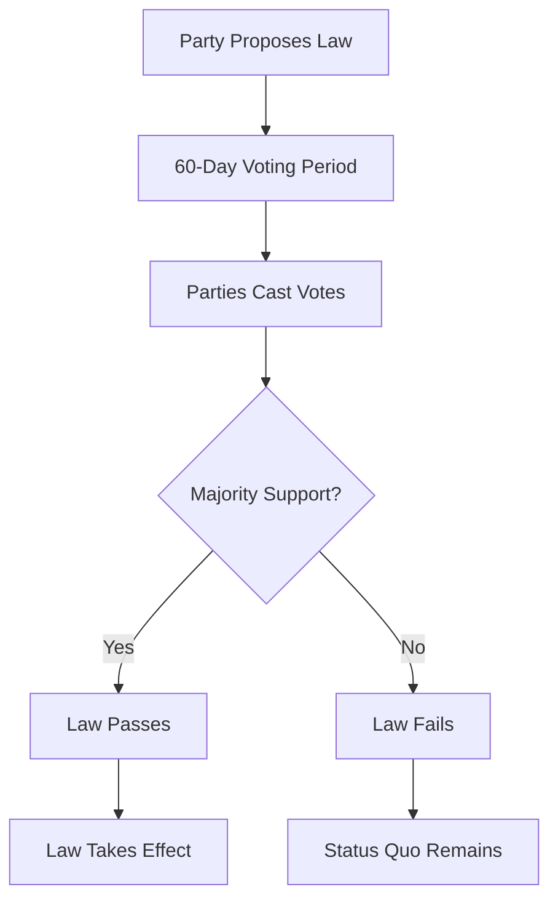

# Legislation & Voting

The **legislative system** is the heart of Lawmaker. This guide explains how to propose laws, vote on legislation, and understand the voting process.

## How Legislation Works

### The Process

1. A party **proposes** a new law (costs 30 PP)
2. All parties can **vote** during a 60-day period
3. Votes are weighted by **seat count**
4. After 60 days, votes are tallied
5. **Majority support** → law passes
6. **Majority opposition** → law fails
7. Laws take effect immediately when passed

## Understanding Laws

### Law Structure

Each law in Lawmaker has:

- **Name** - What the law governs (e.g., "Minimum Wage Policy")
- **Code** - Unique identifier (e.g., `MIN_WAGE`)
- **Options** - Different policy positions (usually 2-3 choices)
- **Current state** - Which option is currently active

### Law Options

Each law has multiple **options** representing different policy positions:

!!! example "Minimum Wage Law"
    **Current state:** Basic minimum wage

    **Options:**

    1. **No minimum wage** - Let the market decide wages
    2. **Basic minimum wage** - Ensure a minimum living standard
    3. **High living wage** - Guarantee comfortable living for all workers

    Each option represents a different philosophical approach.

### Law Categories

Laws cover areas like:

- **Labor & Economy** - Minimum wage, unions, taxation
- **Social Policy** - Healthcare, education, welfare
- **Environment** - Emissions, conservation, green energy
- **Immigration** - Border policy, citizenship, quotas
- **Defense & Security** - Military spending, police powers
- **Civil Rights** - Equality, freedom of speech, privacy
- **Governance** - Electoral rules, government structure

See the full catalog: [Laws & Policies](../laws-and-policies.md)

## Proposing Legislation

### Creating a Proposal

To propose a new law:

1. Ensure you have **30 Political Power**
2. Navigate to the "Propose Law" page
3. Fill in the proposal details (title, description, articles)
4. Choose a **front person** — the activist who will sponsor the bill
5. Submit for voting

### Front Person (Bill Sponsor)

Each proposal can have a **front person** — an [activist](characters.md) from your party who publicly sponsors the bill. The front person's stats directly affect how persuasive the proposal appears to voters:

- **Authority** — experienced, credible activists make stronger sponsors
- **Followers** — well-known activists lend more weight to proposals
- **Persuasion** — charismatic speakers are more convincing

!!! warning "No Sponsor Penalty"
    Proposals submitted **without** a front person receive a 5% persuasiveness penalty. Always assign your best activist to important bills!

!!! tip "Choose Wisely"
    Your best persuader should sponsor your most important proposals. A Charismatic, Fantastic Speaker with high authority makes a much stronger front person than a new recruit.

### Proposal Components

#### 1. Proposal Title

Give your proposal a descriptive name:

- ✓ **Good**: "Workers' Rights and Minimum Wage Act"
- ✓ **Good**: "Green Energy Transition Package"
- ✗ **Bad**: "My Proposal"
- ✗ **Bad**: "Law #1"

#### 2. Proposal Description

Explain why you're proposing this law:

- What problem does it solve?
- How will it benefit the country?
- Why should other parties support it?

!!! tip "Writing Good Descriptions"
    Persuasive descriptions increase the chances other parties will support your proposal. Explain the reasoning, not just the mechanics.

#### 3. Articles

Each proposal contains 1-5 **articles** - individual law changes:

- **Minimum**: 1 article (simple proposal)
- **Maximum**: 5 articles (complex reform package)
- Each article changes one law from its current option to a new option

!!! example "Multi-Article Proposal"
    **"Social Welfare Reform Act"**

    - Article 1: Change healthcare from "Private system" to "Universal healthcare"
    - Article 2: Change education from "Paid tuition" to "Free public education"
    - Article 3: Change minimum wage from "None" to "Basic minimum"

    This is a package deal - all three pass or none pass.

### Strategic Proposal Design

#### Single vs. Multi-Article

=== "Single-Article Proposals"
    **One law change**

    ✓ Easier to build consensus
    ✓ Clear message to voters
    ✓ Higher chance of passage
    ✗ Uses full 30 PP for one change

=== "Multi-Article Proposals"
    **Multiple law changes (2-5)**

    ✓ Efficient use of PP
    ✓ Can create coherent policy packages
    ✓ Forces other parties to accept whole package
    ✗ Harder to get support
    ✗ One controversial article can sink entire proposal

#### Timing Your Proposals

Consider:

- **Early in election cycle** - Safe time to propose controversial laws
- **Mid-cycle** - Normal legislative activity
- **Late in cycle** - High visibility, defines your pre-election platform
- **After election** - Claim a mandate from voters
- **During coalition talks** - Demonstrate legislative priorities

### Proposal Costs

Each proposal costs **30 Political Power**, regardless of:

- Number of articles (1-5 all cost the same)
- Complexity of changes
- Whether it passes or fails

Plan accordingly! See [Political Power](resources.md) for resource management.

## Voting on Proposals

### The Voting Period

- **Duration**: 60 game days (2.5 real days)
- **Open voting**: All parties can see how others voted
- **Can change vote**: Change your mind anytime before closing
- **Automatic closure**: Voting ends after 60 days

### Casting Your Vote

For each proposal, you choose:

=== "Yes"
    **Support the proposal**

    - You want these laws to pass
    - Aligns with your ideology
    - Part of a coalition agreement

=== "No"
    **Oppose the proposal**

    - You disagree with these changes
    - Conflicts with your values
    - Strategically opposing a rival

=== "Abstain"
    **Neutral / No position**

    - You don't have strong feelings
    - Minor issue for your party
    - Politically safer than taking a stance

### Vote Weight

Your vote is weighted by **seats held**:

- Party with 100 seats = 100 votes
- Party with 10 seats = 10 votes
- Party with 0 seats = 0 votes (can't vote)

!!! warning "No Seats = No Vote"
    Parties without seats in a legislature cannot vote on proposals for that legislature. Win seats in [elections](elections.md) to gain voting power!

### How Votes Are Tallied

After 60 days:

1. Count all "Yes" votes (weighted by seats)
2. Count all "No" votes (weighted by seats)
3. **If Yes > No**: Proposal **passes**
4. **If No ≥ Yes**: Proposal **fails**
5. Abstentions don't count either way

!!! example "Vote Tally Example"
    **Total seats in legislature**: 650

    **Votes cast:**
    - Party A (250 seats): Yes
    - Party B (200 seats): Yes
    - Party C (150 seats): No
    - Party D (50 seats): Abstain

    **Result:**
    - Yes votes: 450 (250 + 200)
    - No votes: 150
    - Abstentions: 50 (don't count)

    **Outcome**: Proposal **passes** (450 > 150)

## Voting Strategy

### Ideological Voting

Vote according to your party's [ideology](parties.md#defining-your-ideology):

- Builds consistent legislative record
- Voters reward consistency
- Clear party brand
- Easier to predict and explain

### Strategic Voting

Consider:

- **Coalition agreements** - Honor deals with allies
- **Electoral timing** - Popular vs. unpopular votes
- **Voter preferences** - What the electorate wants
- **Opposition tactics** - Block rival parties' proposals

### The Abstention Strategy

Abstaining can be useful when:

- **Issue is minor** - Save political capital for important fights
- **Coalition conflict** - Avoid breaking agreements
- **Uncertain voter response** - Don't risk taking unpopular position
- **Lack of information** - Need more time to decide

!!! warning "Overuse of Abstentions"
    Voters may see excessive abstentions as weak leadership. Use sparingly!

### Reading the Room

Check voting trends:

- How are other parties voting?
- Who are your natural allies supporting?
- Is there a consensus forming?
- Will your vote matter?

### Vote Switching

You can **change your vote** before the 60-day period ends:

- Respond to coalition negotiations
- React to new information
- Adjust to changing voter sentiment
- Fix mistakes

### Withdrawing a Proposal

The proposing party can **withdraw** a proposal at any time before the voting period ends:

- The proposal is immediately removed from active voting
- The 30 PP cost is **not refunded**
- Useful if you realise the votes aren't there or circumstances have changed

### Multi-Legislature Voting

In countries with **bicameral systems** (two chambers), proposals may need to pass in multiple legislatures simultaneously. Each legislature votes independently, and the proposal must achieve a majority in **all** required chambers to pass.

## After the Vote

### If Proposal Passes

- Laws change immediately
- Country's law state updates
- Proposing party gets credit
- All votes are recorded in legislative history

### If Proposal Fails

- Status quo remains
- Laws don't change
- Proposing party loses 30 PP with no result
- All votes still recorded (voters remember!)

### Legislative History

Every vote is **permanently recorded**:

- Voters analyze your voting history
- Other parties research your positions
- Historical records show party evolution
- Can't delete or hide past votes

!!! danger "Votes Are Forever"
    Every vote shapes your party's reputation. Vote carefully - you can't take it back!

## Advanced Tactics

### Log-Rolling

**Definition**: Trading votes - "I'll support your proposal if you support mine"

- Common in coalition politics
- Can build legislative majorities
- Requires trust and communication
- Use the [messaging system](communication.md)

### Blocking Coalitions

Coordinate with other parties to **block** a rival's proposal:

- Organize opposition through messages
- Ensure enough "No" votes
- Prevent rivals from achieving their goals

### Poison Pills

Add **controversial articles** to multi-article proposals:

- Forces opponents to oppose the entire package
- Can sink otherwise popular legislation
- Risky: may backfire and hurt your own proposal

### Timing Games

Strategic use of the 60-day window:

- Vote early to signal commitment
- Vote late to see others' positions
- Change vote at last minute
- Coordinate surprise coalition votes

## Proposal Comments

### Discussion System

Each proposal has a **comment thread**:

- Argue for or against the proposal
- Explain your vote to other parties
- Try to persuade others to change votes
- Build public record of debate

### Using Comments Strategically

- **Rally support**: Persuade undecided parties
- **Explain votes**: Justify controversial positions to voters
- **Negotiate**: Offer to change vote if articles amended
- **Campaign**: Use as public platform for your values

## Tips for Legislative Success

!!! success "Proposal Tips"
    - **Build coalitions first** - Line up support before proposing
    - **Keep it simple** - Single-article proposals pass more often
    - **Write compelling descriptions** - Persuasion matters
    - **Time it right** - Consider election cycles
    - **Have backup plans** - Don't spend PP on doomed proposals

!!! success "Voting Tips"
    - **Vote consistently** - Align with your ideology
    - **Vote on everything** - Abstaining too much looks weak
    - **Read proposals carefully** - Understand what you're voting for
    - **Communicate with allies** - Coordinate coalition votes
    - **Remember voters are watching** - Every vote affects elections

## Next Steps

- [Elections & Voters](elections.md) - How your voting record affects elections
- [Government & Cabinet](cabinet.md) - Forming governments after elections
- [Political Power](resources.md) - Managing your action resources
- [Communication](communication.md) - Negotiating with other parties
- [Strategy Guide](../strategy-guide.md) - Advanced legislative tactics
