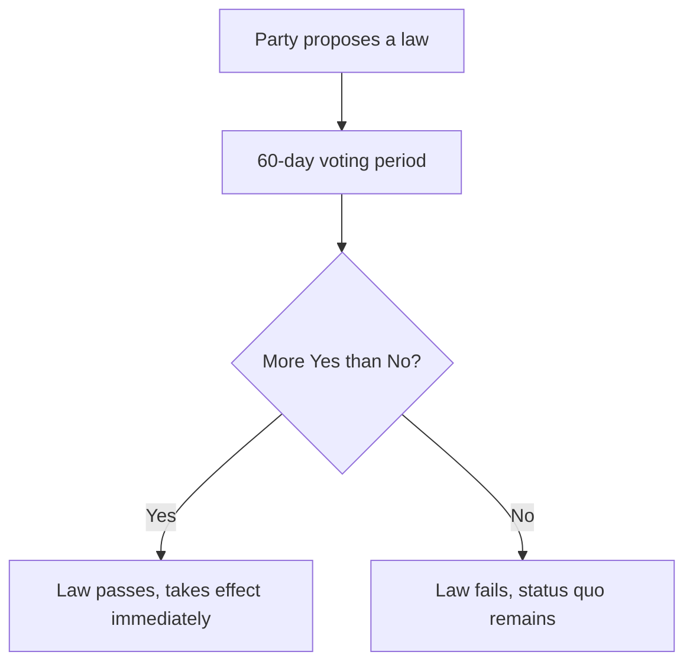

# Legislation & Voting

Legislation is the heart of Lawmaker. Parties propose changes to the country's laws, everyone votes, and the results become part of each party's permanent record. This guide covers how to propose laws and how voting works.

## How a law passes

```mermaid
graph TD
    A[Party proposes a law] --> B[60-day voting period]
    B --> C{More Yes than No?}
    C -->|Yes| D[Law passes, takes effect immediately]
    C -->|No| E[Law fails, status quo remains]
```

1. A party **proposes** a law (costs 30 PP).
2. All parties **vote** Yes, No, or Abstain over a **60 game-day** window (about 2.5 real days).
3. Votes are **weighted by seats** — a party with 100 seats casts 100 votes; a party with 0 seats can't vote.
4. When the window closes, if Yes outweighs No the law passes and takes effect immediately. Otherwise the status quo holds. Abstentions don't count either way.

## What a law looks like

Each law governs one policy area (for example, *Minimum Wage Policy*) and has several **options** representing different positions. A proposal swaps one or more laws from their current option to a new one.

!!! example "Minimum Wage Policy"
    - **No minimum wage** — let the market decide
    - **Basic minimum wage** — a minimum living standard *(current)*
    - **High living wage** — a comfortable standard for all workers

There are 95 laws across 21 policy areas. The authoritative, up-to-date catalogue — with each law's current setting and options — lives in the game itself, on your country's **Laws** page and the **International Laws Explorer** (which compares positions across every country). Use them to see the status quo before proposing a change.

## Proposing a law

A proposal bundles **1–5 articles**, each changing one law. It costs **30 PP** regardless of how many articles it contains or whether it passes.

When you propose, you give it a clear title and a description making the case for it, then choose a **front person**.

### The front person

The front person is an [activist](characters.md) from your party who sponsors the bill. Their **authority**, **followers**, and **persuasion** make the proposal more convincing to voters — so put your strongest speaker on your most important bills. A proposal with **no** front person takes a **5% persuasiveness penalty**, so always assign one.

### One article or several?

- **Single-article** proposals are easier to build consensus around and send a clear message.
- **Multi-article** packages let you bundle a coherent agenda into one 30 PP proposal — but they're all-or-nothing, so one controversial article can sink the whole package.

### Drafts and stale bills

A new proposal starts as a private **draft**, visible only to your party, and it costs nothing until you open it for the 30 PP vote. While it sits in draft, another party's bill can pass and move a targeted law to the very option your draft was aiming for — leaving it a no-op that would achieve nothing if opened.

Lawmaker watches for this: a draft whose law has already been overtaken gets an **"Already in effect"** badge, both in your proposals list and on the article itself within the draft, plus a banner naming which party made the change and when. It's advisory only — you can still open the bill — but it's a cue to edit out the stale article or discard the draft rather than spend 30 PP for nothing.

## Voting on proposals

Open proposals appear on your country page. For each one you cast **Yes**, **No**, or **Abstain**, and you can **change your vote** any time before the window closes — useful as coalition negotiations evolve.

!!! warning "No seats, no vote"
    Voting weight comes from seats. A party with 0 seats in a legislature can't vote on its proposals — win seats in [elections](elections.md) first.

A few mechanics worth knowing:

- **Withdrawing:** the proposing party can pull a proposal before the window closes, but the 30 PP is **not** refunded.
- **Bicameral countries:** where there are two chambers, a proposal must reach a majority in **all** required chambers to pass.
- **Royal veto:** in countries with a [monarchy](monarchy.md#royal-assent-and-veto), the monarch can block a bill that the legislature passed. The veto stays hidden during voting and is only revealed if it changes the outcome.

## Your record is permanent

Every vote is recorded forever. Voters analyse your history, other parties research your positions, and you can't delete or hide a vote once cast. A failed proposal still costs you the 30 PP **and** leaves the vote on everyone's record — which is exactly why lining up support *before* you propose matters so much.

For the tactics of *when* and *what* to propose — timing across the election cycle, vote-trading, building majorities — see the [Strategy Guide](../strategy-guide.md).

## Next steps

- [Elections & Voters](elections.md) — how your voting record turns into seats.
- [Characters & Activists](characters.md) — recruit strong front-people.
- [Communication](communication.md) — negotiate support before you propose.
- [Quick Reference](../reference.md) — the PP costs and voting rules at a glance.
