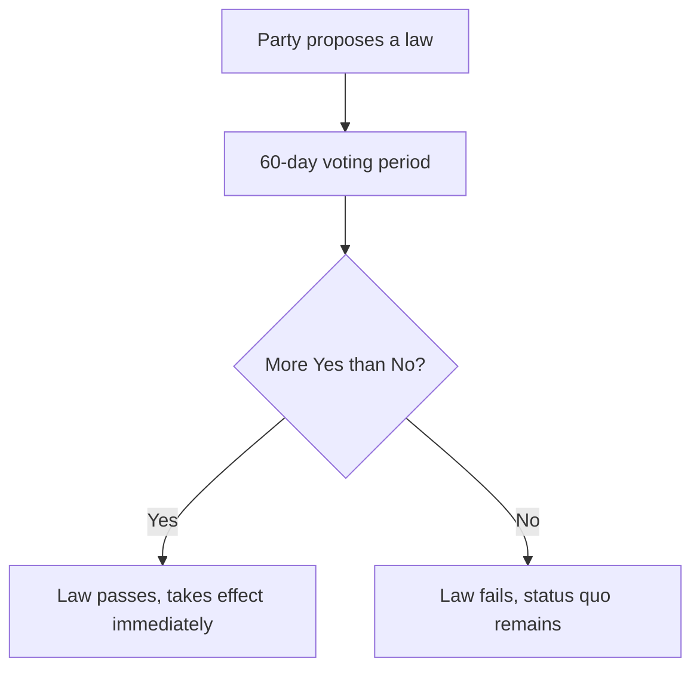

# Legislation & Voting

Legislation is the heart of Lawmaker. Parties propose changes to the country's laws, everyone votes, and the results become part of each party's permanent record.

## How a law passes

```mermaid
graph TD
    A[Party proposes a law] --> B[60-day voting period]
    B --> C{More Yes than No?}
    C -->|Yes| D[Law passes, takes effect immediately]
    C -->|No| E[Law fails, status quo remains]
```

1. A party **proposes** a law (30 PP).
2. All parties **vote** Yes, No or Abstain over a **60 game-day** window (about 2.5 real days).
3. Votes are **weighted by seats**: a party with 100 seats casts 100 votes, and a party with 0 seats can't vote.
4. When the window closes, if Yes outweighs No the law passes and takes effect immediately. Otherwise the status quo holds. Abstentions count neither way.

## What a law looks like

Each law governs one policy area (for example, *Minimum Wage Policy*) and has several **options** representing different positions. A proposal swaps one or more laws from their current option to a new one.

!!! example "Minimum Wage Policy"
    - **No minimum wage**: let the market decide
    - **Basic minimum wage**: a minimum living standard *(current)*
    - **High living wage**: a comfortable standard for all workers

There are 148 laws across 20 policy areas. The Laws page and the International Laws Explorer in the game show each law's current setting and options, so check the status quo before proposing a change. A country in an [international treaty](treaties.md#locked-laws) may have some laws **locked**: you can't propose moving them to options the treaty forbids.

## Proposing a law

A proposal bundles **1-5 articles**, each changing one law. It costs **30 PP** however many articles it has and whether or not it passes. You give it a title, a description making your case, and a **front person**.

- **Single-article** proposals are easier to build consensus around and send a clear message.
- **Multi-article** packages bundle a coherent agenda into one 30 PP proposal, but they are all-or-nothing, so one controversial article can sink the whole package.

A new proposal starts as a private **draft** visible only to your party, and costs nothing until you open it for voting. While it sits in draft, another party's bill can pass and move a law to the very option your draft was aiming for, leaving that article pointless, so edit it out or discard the draft rather than spend 30 PP for nothing.

### The front person

The front person is an [activist](characters.md) from your party who sponsors the bill. Their **authority**, **followers** and **persuasion** make the proposal more convincing to voters, so put your strongest speaker on your most important bills. A proposal with **no** front person takes a **5% persuasiveness penalty**.

## Voting on proposals

For each open proposal you cast **Yes**, **No** or **Abstain**, and you can **change your vote** any time before the window closes, which is useful as coalition negotiations evolve.

!!! warning "No seats, no vote"
    Voting weight comes from seats. A party with 0 seats in a legislature can't vote on its proposals. Win seats in [elections](elections.md) first.

A handful of laws attack the mechanisms of accountability, such as press control, protest bans and mass surveillance. Voting **Yes** on one of these stains your party's [autocracy score](executive-actions.md#authoritarian-laws): the full points if you proposed it, half if you just voted for it. You are warned before you commit.

- **Withdrawing:** the proposing party can pull a proposal before the window closes, but the 30 PP is **not** refunded.
- **Bicameral countries:** a proposal must reach a majority in **all** required chambers to pass.
- **Royal veto:** in a [monarchy](monarchy.md#royal-assent-and-veto) the monarch can block a bill the legislature passed. The veto stays hidden during voting and is revealed only if it changes the outcome.

### Elected office veto

An elected office, such as a presidency, casts no votes of its own but can still block a bill. A bill that clears the legislatures **fails** if all of these hold when it closes:

- the office has a **veto** (on by default; a [major constitutional change](constitution.md#elected-office-veto) can switch it on or off);
- the office is **held**; and
- the holder's party votes **No**. The party's single vote counts for the office as well as the chambers. If its vote differs between chambers, it counts as No only when it voted No everywhere it didn't abstain.

Abstaining, not voting, a vacant office and a veto switched off never block a bill. A party can't vote against its own proposal, so an office never blocks a bill its holder's party proposed. Offices have no say over budgets or constitutional changes.

The rule is read when the bill closes, so a bill is decided under the veto setting and office holder at that moment, not those in place when it was proposed. If the country also has a monarch, the legislatures and offices are judged first. A bill that fails there, including because an office blocked it, never reaches royal assent, and any pending royal veto is discarded unrevealed.

## Your record is permanent

Every vote is recorded forever. Voters analyse your history, other parties research your positions, and you can't delete or hide a vote once cast. A failed proposal still costs you the 30 PP **and** leaves the vote on everyone's record, which is why lining up support *before* you propose matters so much.

For the tactics of *when* and *what* to propose, see the [Strategy Guide](../strategy-guide.md).

## Next steps

- [Elections & Voters](elections.md): how your voting record turns into seats.
- [Characters & Activists](characters.md): recruit strong front people.
- [Communication](communication.md): negotiate support before you propose.
- [Quick Reference](../reference.md): the PP costs and voting rules at a glance.
